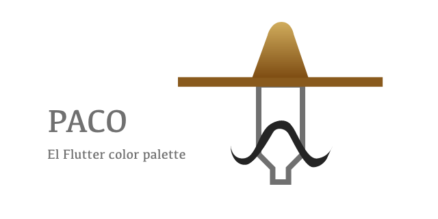

# Paco



A flutter color palette with an eyedropper ( on mobile & desktop )

| Light theme | Dark theme |
| --- | --- |
|  |  |

- [example](https://rxlabz.github.io/paco/#/) / [source](https://github.com/rxlabz/paco/blob/master/paco_example/lib/main.dart)

### Eyedropper

Select a color from your Flutter mobile or desktop screen.

 

To use the eyedropper ( Flutter mobile & desktop ) you need to wrap the app in the EyeDrop widget.

```dart
@override
  Widget build(BuildContext context) {
    return EyeDrop(
      child: Builder(
        builder: (context) => Scaffold(
          backgroundColor: backgroundColor,
          body: Container(
            child: ColorButton(
              key: Key('c1'),
              color: color1,
              config: ColorPickerConfig(enableLibrary: false),
              boxShape: BoxShape.rectangle, // default : circle
              size: 32,
              swatches: swatches,
              onColorChanged: (value) => setState(() => color4 = value),
            ),
          ),
        ),
      ),
    );
  }
```

### Customisable

- disable opacity slider
- disable eye dropping 
- disable swatch library
- Circle or Square color buttons

```dart
ColorButton(
  key: Key('c1'),
  color: color1,
  config: ColorPickerConfig(
    this.enableOpacity = true,
    this.enableLibrary = false,
    this.enableEyePicker = true,
  ),
  boxShape: BoxShape.rectangle, // default : circle
  size: 32,
  swatches: swatches,
  onColorChanged: (value) => setState( () => color4 = value ),
 );

ColorButton(
  key: Key('c2'),
  color: color2,
  config: ColorPickerConfig(enableEyePicker: false),
  size: 64,
  swatches: swatches,
  onColorChanged: (value) => setState( () => color4 = value ),
  onSwatchesChanged: (newSwatches) => setState(() => swatches = newSwatches),
 );
```


